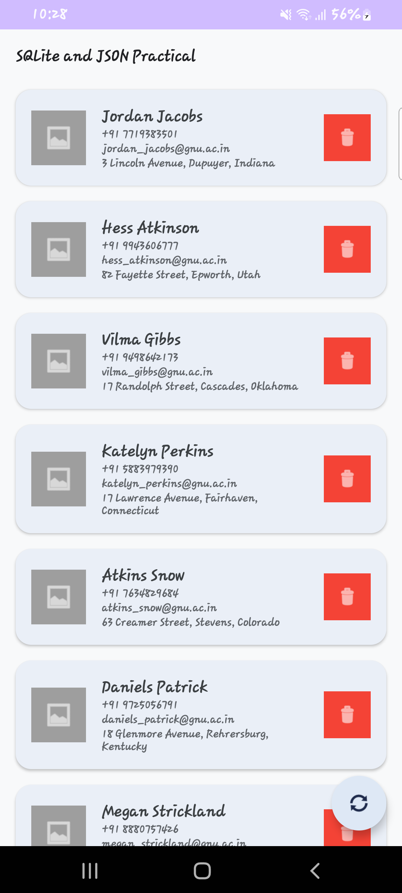
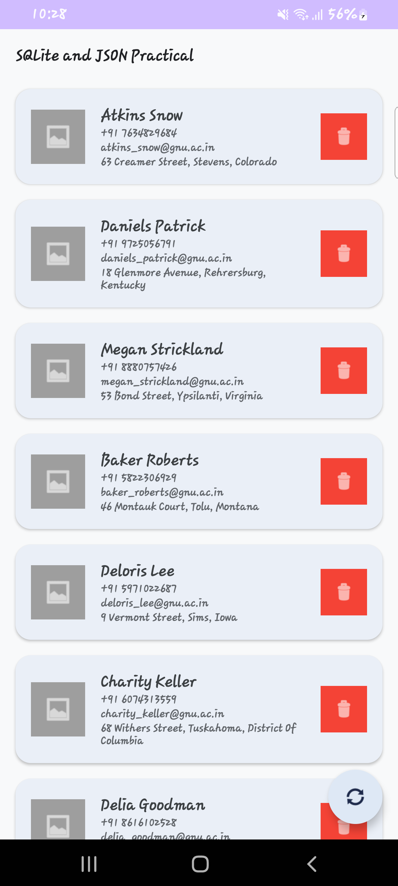

# Practical 7

**Name:** Nihal Shah  
**Enrollment No.:** 24012011175

## Aim
Develop an Android application that retrieves person data in JSON format from an internet API and stores the retrieved data in an SQLite database.
## 📖 About the Practical

This practical demonstrates how an Android application can retrieve data from an online API and store it locally.

The application fetches person information in JSON format using `HttpURLConnection`. The network operation is performed in the background using Kotlin Coroutines so that the main UI thread is not blocked.

The retrieved JSON data is converted into `Person` objects and displayed using a `RecyclerView`.

The application also uses an SQLite database with `SQLiteOpenHelper` to store the person data locally, allowing the data to remain available offline.

---
## Key Concepts and Technologies
*   **JSON Parsing:** Extracting structured data from web APIs.
*   **Networking:** Making HTTP GET requests using `HttpURLConnection` to fetch data.
*   **Coroutines:** Executing network operations asynchronously using `CoroutineScope(Dispatchers.IO)` to prevent blocking the main UI thread.
*   **RecyclerView:** Efficiently displaying lists of data with a custom adapter (`PersonAdapter`).
*   **SQLite Database:** Persisting data locally using `SQLiteOpenHelper` for offline access (inserting, getting, updating persons).
*   **Serialization:** Passing custom objects (`Person`) between components using `Intent` extras and `Serializable`.
*   **Permissions:** Requesting internet permissions in the manifest to allow external API communication.

## Screenshots

  <!-- Replace 'screenshot1.png' and 'screenshot2.png' with your actual screenshot file names and place them in the root directory alongside this README or update the path to the images -->
  
  &nbsp;&nbsp;&nbsp;&nbsp;&nbsp;
  

